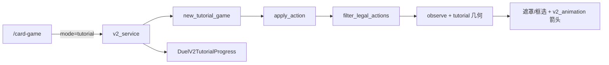
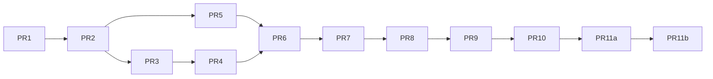

# 异象对决 V2 新手教学关卡设计

| 字段 | 内容 |
| --- | --- |
| 文档路径（入库后） | [docs/duel-v2-tutorial-design.md](duel-v2-tutorial-design.md) |
| 作者 | TBD |
| 日期 | 2026-09-15 |
| 状态 | 当前实现摘要；原 12 关设计案保留为历史参考 |
| 规则真源 | [everness-item-chain-card-design.md](everness-item-chain-card-design.md) |
| 牌面用语 | [duel-v2-card-text.md](duel-v2-card-text.md) |
| 演出 | [duel-v2-presentation-20260912.md](duel-v2-presentation-20260912.md)、`v2_animation.js`、`v2_table/interaction.js` |

## 当前实现与文案（2026-09-21）

当前为 **13 关**。行动力教学已合并到第一关；前 10 关为 2v2，第 11 关为 4v4，第 12 关白热化与第 13 关远程为 2v2。scenario ID 保留历史编号，不等于玩家看到的关卡序号。运行配置见 `app/modules/card_game/content/duel_v2/tutorial/pack.py`。

| 显示序号 | 名称 | scenario |
| ---: | --- | --- |
| 1 | 牌桌与回合 | `tutorial_l01_board` |
| 2 | 手牌 | `tutorial_l02_hand` |
| 3 | 战术 | `tutorial_l04_tactic` |
| 4 | 倒地 | `tutorial_l05_down` |
| 5 | 武备 | `tutorial_l06_form` |
| 6 | 环合 | `tutorial_l07_harmony` |
| 7 | 终结 | `tutorial_l08_energy` |
| 8 | 瞬发 | `tutorial_l09_instant` |
| 9 | 响应 | `tutorial_l10_response` |
| 10 | 穿透 | `tutorial_l11_pierce` |
| 11 | 四人编队 | `tutorial_l12_roster4` |
| 12 | 白热化 | `tutorial_l13_escalation` |
| 13 | 远程 | `tutorial_l14_ranged` |

- 第十关的目录、关卡标题与弹窗统一使用「穿透」。
- 双人教程在手机上也保持左右对称站位：对手两个卡槽均为 `top: 4%`，我方均为 `bottom: 3%`。四人编队的外侧弧形偏移不应用于双人教程，出击后的半透明占位沿用同一槽位。
- 双人教程左右卡槽均从边缘 22% 收近至 28%，缩短与中央战斗区的距离；双方战斗区中线显示半透明水平分界线，与正式牌桌共用。
- 手机横屏使用默认收起的悬浮手牌，手牌讲解／操作步骤自动展开；空白点击切换后同步重绘框选，拖动中不收起。手机手牌箭头指向对战区，目标在松手后再点选；战术教学文案区分手机二次选择和电脑可选的拖动选目标。
- 悬浮手牌验收：667×375 与 944×427 通过真实触控完成第三关治疗，展开／收起均不改变战斗区高度，拖动期间保留手牌，松手不提交、选中薄荷后恰好提交一次。另用正式引擎生成的 Q01 观察夹具验证默认隐藏、非法落点保留手牌、多选效果在松手后选择，以及切回桌面仍保留原拖动选择偏好；夹具验证不冒充完整对局。教学脚本 9 项通过。
- 第一关战斗区介绍拆为 `l01_opponent_front` 与 `l01_player_front`：先只框选对手战斗区，说明前排优先与空场攻击玩家；再只框选我方战斗区，说明拖入出击与留场防守。两步分别确认后继续介绍玩家生命。说明面板靠右，手机横屏时不遮住中央被框选区域。
- 第十一关步骤为 `l12_mulligan` → `l12_roster` → `l12_empty`。换牌可选 0–3 张，不强制指定某张；空库为说明步骤，确认后完成教学，不运行旧案的空抽获胜脚本。
- 四人编队说明区分正式对局的 4 人 / 32 张和教学专用牌库，不声称教学牌库就是正式构筑。
- 回合抽牌统一说明为「自己的回合开始时，抽 1 张牌。」不单独强调先手。前面的固定教学关卡关闭通常抽牌，第十一关开启。
- 空库提示为「抽牌时若牌库已空，会立刻失败。留意剩余牌数，合理使用抽牌效果，避免空库时再次抽牌。」不提示通过构筑增加牌库，也不把抽走最后一张牌当成失败。
- 先手首回合 1 点行动力、其他普通回合 2 点；终结不消耗行动力。前 11 关不启用白热化，第 12 关显式启用。

验证：`python3 -m unittest tests.test_duel_v2_tutorial`，覆盖全关脚本、公开文案与标题一致性。

### 第十二关：白热化（用户确定的后手第 4–6 回合）

- scenario：`tutorial_l13_escalation`。使用既有教学主角、薄荷与两个木桩；不新增正式角色或卡牌。后手是玩家 a，先手为 b；预置总第 4 回合开始，双方已各开始 2 次回合，玩家行动力 2。
- 主角能量 4/5、薄荷 5/5。关闭通常抽牌、战斗资源与无关机制，仅本关显式启用正式白热化结算。
- 步骤：`l13_intro` 看第 4 回合与左侧预告 → `l13_energy` 看两人能量 → `l13_end` 结束回合（对方第 5 回合仅结束） → `l13_refill` 看第 6 回合补能和两次终结 → `l13_first` 主角终结 → `l13_second` 薄荷终结 → `l13_done` 简述后续阶段并完成。
- 第 6 回合开始主角必然是最低能量存活角色，补到 5/5；两次终结分别扣本人 5 点能量，不扣行动力，次数 2 → 1 → 0。前 11 关保持原来的固定规则。
- 第 13 回合降低能量上限、第 20 回合降低环合上限只在结尾说明；本关终局仍为总第 6 回合，不快进、不要求打到 20。
- 新框选 token：`round` 指向总回合标签，`escalation` 指向左侧预告，`ultimate_count` 指向终结剩余次数；实际终结操作通过 `ultimate:{side}:{cid}` 框选对应角色的终结按钮。
- 已完成原 11 关的玩家自动获得第 12 关入口；明确跳过教学的状态继续保留。第十一关按钮改为“完成本关”，新关完成后才毕业。
- 验证命令：`python3 -m unittest tests.test_duel_v2_tutorial tests.test_duel_v2_escalation tests.test_duel_v2_api`（42 项通过），另有引擎与回放 73 项通过。浏览器从大厅的原毕业账号进入本关，实际完成结束回合、两次终结与完成教学：终局仍为总第 6 回合，能量均为 0/5、终结机会 0、行动力 2。

### 2026-09-20 手机终结触控修复

- 较窄横屏中，手机终结按钮伸到角色卡右侧，与中央战斗区重叠；原备战区层级低于战斗区，导致按钮可见但触摸命中战斗区。存在终结按钮的备战区与卡槽提升层级，按钮继续走原有合法动作提交。
- 第七关及第十二关的终结操作直接框选按钮并显示点击提示，保留按钮原有绝对定位。第七关说明弹窗按钮改为「继续」，操作提示明确点击角色的「终结」按钮。
- 本地 Chrome 触控模拟：667×375、740×360、844×390、944×427 均通过大厅进入第七关，真实点击终结后由后端确认通关；修复前前三种尺寸被 `#v2-play-area` 拦截。
- 667×375 下完成第十二关结束回合、主角与薄荷各一次终结和通关；1440×900 下完成第七关。已检查手机与桌面截图，按钮高亮保持原位置，无 JavaScript 页面异常。
- `tests.test_duel_v2_tutorial` 与 `tests.test_duel_v2_escalation` 共 16 项通过。另跑牌桌契约测试，3 项既有静态字符串断言失败（旧固定 CSS 尺寸与旧回放函数名），对照修改前 HEAD 同样失败，不作为本次通过项。

### 第十三关：远程（2026-09-21）

- scenario `tutorial_l14_ranged`，不改变旧十二关顺序；已完成旧十二关的玩家自动获得本关入口，明确跳过的状态保留。第十二关按钮改为「完成本关」，本关结束才完成全部教学。
- 独立教学海月（魂，3/4）与薄荷，对方为娜娜莉与早雾；海月初始生命 1、能量 6，终结文案与正式海月一致，持续至本回合结束。教学海月仅接入远程终结，不复用正式角色整套异能或卡效；图片复用现有资源，不进正式卡池。
- 开局对方娜娜莉出击并结束回合，玩家获得通常的 2 点行动力。依次执行：说明远程 → 打出薄荷「特遣行动」占前排 → 点击海月终结 → 拖动海月远程普通出击 → 看结果并完成。
- 薄荷攻击后为 2/4，娜娜莉剩 2 生命；海月远程造成 3 点伤害、反击 0，仍为 1/4 且留在备战区，薄荷仍在前排。终结不扣行动力，两次出击各扣 1 点，最后为 0；普通出击机会已用。
- 无关抽牌、环合、能量积累、白热化和穿透关闭；实际战斗与预览复用正式引擎的 `sortie_from_bench` 能力，不另写教学伤害计算。
- 遮罩分别突出手牌、终结按钮、海月与前排；出击沿用拖到对战区的操作。结尾解释前排优先、不触发入场环合、不免疫其他伤害，以及己方空前排仍暴露玩家的风险。
- 验收：五次重开一致；JSON 恢复后仅允许海月出击，预览不换人且反击 0，己方无入场／移动／环合事件；旧毕业账号经 API 完整通关、幂等重试和落库刷新，保留旧进度。

## 历史参考：2026-09-14 原 12 关设计案

> **以下全部内容（包括 Overview、关卡总表、逐关脚本、验收及 PR Plan）为旧设计快照，不再作为当前实现或文案的验收口径。** 旧案中的 12 关、指定换牌、首回合不抽牌、完整空抽获胜演示等已被上方当前实现说明替代；保留只用于追溯设计过程。

V2 多关教学，不是盖卡迁移。正式 4 人 / 32 张不变。手册 §3「终结耗 1 行动力」过期，教学按 AGENTS.md 与 `start_ultimate(..., spent_ap=False)`。手册 §3 另改。

**本轮产品锁：** 倒地提前到武备之前；武备关必须演示倒地脱落；穿透前先教瞬发与响应；删除负面关与选修家族壮大；四人关教起手换牌，并提一嘴抽空牌库立即失败。

---

## Overview

大厅 `/card-game` 进入独立 `tutorial_*` 战役。前 11 关真 **2v2：主角+薄荷 vs 娜娜莉+早雾**（不上满）。第 12 关才 4 人，并教换牌与空牌库。覆盖层叠在 `apply_action` 上，不 fork 战斗。引导几何（遮罩 / 框选 / 箭头）每步写死，结算箭头复用 `game.presentation` 的 `actor`/`target`/`group_id`。

---

## Background & Motivation

大厅只有人机 / 1v1。`validate_deck` 与 `new_game` 断言 4/32。旧盖卡教程（部署/揭示/隐藏编队）禁止复用。用户要求逐机制、真 2v2、独立教学卡。

---

## Goals & Non-Goals

### Goals

- `/card-game` 按钮「新手教学」、首次提示、续关、跳过、与人机冲突。
- 12 关线性战役（见总表）。每关可按本文脚本 + 引导几何实现与金标测试。
- 2 人侧 `character_slots: 2`；正式 `validate_deck` 仍要 4 人。
- 倒地在武备前；武备关含倒地脱落；瞬发、响应在穿透前。
- 第 12 关：4 人备战 + 起手换牌（最多 3 张、一次）+ 抽空牌库失败演示。

### Non-Goals

- 不教早雾负面、家族壮大、浊燃、浔、倾陷满 5。
- 阿德勒不开局。不把教学卡并入 `catalog.json`。
- 不新增教学 log projector。不发明第三套日志措辞。

---

## Key Decisions

1. 独立多关战役 + 真 2v2，不上满。
2. Overlay 不 fork `combat.attack`。
3. `mode=tutorial`；进度表 `DuelV2TutorialProgress`（不扩展 `TUTORIAL_SCOPES`）。
4. L1：先手、`ap_per_turn=1`、生命 4、**双方 `player_shield: 0`**、无手牌。
5. 主角 = `tutorial_protagonist`，不改正式 `zero`。
6. 终结不耗行动力。
7. 对手脚本不在 legal 集则抛错，不回退 AI。
8. **倒地 = 第 5 关**；**武备刷新 + 倒地脱落 = 第 6 关**。
9. **瞬发、响应分两关，且都在穿透之前。** 教学卡独立 `tutorial_*`，不搬完整「第二位成员」。
10. **删除负面 / 家族壮大关。** 早雾在前几关只当沉默木桩。
11. **第 12 关教换牌，并用对方空抽演示「牌库已空，无法抽牌」立即失败。**
12. 每步一个 `required_action`；`end_turn` 单独成步。金标拒绝提前结束回合。

### Locked for implementation

- 日志 = `observe(a)` 消毒活文本。能量关闭时**不得**再写「全队存活异能者分享能量 +1」。
- `player_shield: 0`；`new_tutorial_game` 不走后手 5 盾。
- 全部 CHARACTERS/CARDS/EFFECTS/KITS 走 `tutorial_lookup`；不写全局 catalog。
- `energy_max` 实例字段。
- `POST start` scenario 必须是下一未通关或已通关；否则 409。
- 唯一新动作 `tutorial_ack`。
- 通关/跳过/重试先 `closed` 房间。教学不 `replay.begin`。
- **引导几何合同见下节；每步填 spotlights / drag_arrow / 结算箭头。**
- 结算箭头只根据 `presentation.events` 的 `actor`/`target`/`group_id`/`type`，浏览器不解析中文日志。

---

## Proposed Design

### 架构



### 查找与旗标闸门

保持上一修订：`character_def` / `card_def` / `effect_fn` / `kit_for` 覆盖 `new_character`、`card_instance`、`knockdowns`、`attack_value`、`set_shape`、投影武备、`EFFECTS`、`fire/decide/tally`。`disable_*` 闸到 `begin_turn` AP/抽牌、`finish_operation` 环合/能量拆开、`combat.attack` overflow、`add_collapse`。`new_tutorial_game` 写 `player_hp`/`player_shield=0`/`starting_hp`，不 `validate_deck`，不洗牌。

`finish_operation` 日志：

- 仅环合：`{名}战斗积累：自己的环合 +{dh}。`
- 仅能量：`{名}战斗积累：自己的能量 +{de}；全队存活异能者分享能量 +1。`
- 两者都关：不打资源 log。
- 两者都开：活格式全文。

### 日志合同

`observe(a)`：`甲方玩家`→`我方玩家`，`乙方玩家`→`对手玩家`。

| 事件 | 文本 |
| --- | --- |
| 入场 | `{角色}进入战斗区。` |
| 响应入场 | `{角色}进入战斗区，作为反击方。` |
| 攻击 | `{角色}攻击{目标}：攻击 {n}，反击 {m}。` |
| 受伤 | `{名}受到 {n} 点伤害（护盾吸收 {m}）。` |
| 返回 | `{角色}返回备战区。` |
| 出牌 | `{角色}使用「{卡}」。` |
| 武备 | `{角色}装备武备：{卡}。` |
| 回复 | `{角色}回复 {n} 点生命。` |
| 环合 | `{入场}入场，消耗{支付}的 2 点环合值，触发创生。` |
| 环合资源（能量关） | `{角色}战斗积累：自己的环合 +1。` |
| 终结 | `{角色}消耗满槽能量，发动终结（持续 2 个己方回合）。` |
| 倒地 | `{角色}倒地，3 次己方回合开始后恢复。` |
| 恢复 | `{角色}在备战区恢复。` |
| 换牌 | `{我方玩家}替换 1 张起手牌。` / `保留全部起手牌。` |
| 抽牌（公开） | `{名}抽 1 张牌。`（对手抽牌无牌名） |
| 空库 | `{名}牌库已空，无法抽牌。` |
| 胜 | `我方玩家获胜。` |

### 大厅文案（PR4 唯一真源）

- 主按钮：**新手教学**。副文案：未开始「逐步学习出击与回合」；进行中「继续第 N 关」；已完成「再看一遍」。
- 位置：人机 / 1v1 **上方**，不是第三个 mode tab。
- 首次进入且 `completed=false` 且 `skipped=false`：非阻断卡片。主按钮「开始新手教学」→ `POST start {mode:tutorial}`。次按钮「稍后再说」→ `skipped_prompt=true`，仍可点大厅按钮。
- 进行中教学房 resume：**继续新手教学**（不要写成普通「返回牌桌」）。
- 教学房 playing 时点人机/1v1：409「正在进行新手教学，请先返回或离开。」
- 人机/1v1 房未 closed 时点教学：409「请先离开当前房间，再开始教学。」
- 跳过全部：按钮「跳过新手教学」，确认后 `skipped=true` `completed=true`，关房回大厅。
- 通关第 12 关：祝贺 +「开始人机对战」。

`scenario` 省略 = `current_level` 或 `tutorial_l01_board`。必须属于 {下一未通关}∪{已通关}∪{当前 playing}。

### 引导几何合同（全关强制）

投影：

```json
{
  "tutorial": {
    "step_id": "l01_p1_attack",
    "ack_required": false,
    "mask": true,
    "spotlights": ["character:a:tutorial_protagonist", "zone:b:front"],
    "blocked_reason": "先让主角出击。",
    "drag_arrow": {
      "from": "character:a:tutorial_protagonist",
      "to": "zone:b:front",
      "when": "drag_attack"
    }
  }
}
```

**遮罩：** `mask=true` 时压暗不在 `spotlights` 的区域；非法点击不发请求，只显示 `blocked_reason`。`ack_required` 步同样遮罩，只放行弹窗按钮。

**框选 id（锁定）：**

| id | DOM |
| --- | --- |
| `character:{side}:{cid}` | `[data-entity-id="{side}:{cid}"]` |
| `zone:{side}:front` | 该侧战斗区槽（可空） |
| `bench:{side}` | 该侧备战区 |
| `player_hp:{side}` | `[data-player-side="{side}"]` |
| `ap:{side}` | 行动力 |
| `end_turn` | 结束回合 |
| `hand:{instance_id}` | 该手牌 |
| `mulligan` | 换牌层 |
| `log` | 最新日志 |

**拖拽预览箭头（教学层，活牌桌目前只有文字 previewBox）：** 拖角色出击时画 **一条** 箭：

- 对方战斗区空：`character:a:…` → `zone:b:front`
- 对方有前排：`character:a:…` → `character:b:{front}`

出牌拖到出牌区：`hand:{id}` → `zone:cast`（`v2-fx-arrow.is-cast`）。

**结算箭头（复用 `v2_animation.js`，禁止从日志推断）：**

| 事件 | 箭 |
| --- | --- |
| `type=attack` 目标 `b:player` | actor → **`player_hp:b`**（`_entity("b:player")`），不是空战斗区 |
| `type=attack` 目标角色 | actor → 目标；`counter>0` 再画回箭 `v2-fx-arrow.is-counter`，**同一 `group_id`** |
| `type=enter` 响应 | 入场者 → 当前战斗区；另见下 |
| `kind=genesis` 伤害 | 入场者 → 创生目标，`is-flower`（本关无 `flower` 事件，不用创生花循环） |
| `type=penetration` | 进攻者 → `player_hp` 对方 |
| 响应换人 | 1）响应者 bench → `zone:{own}:front`；2）随后攻击/反击对打箭 |

PR5 必须保证空前排攻击的 `event.target` 为 `{side}:player`，且 HP 节点有 `data-player-side`。若活 `_presentDamage(genesis)` 不画箭，教学层对 `kind=genesis` 补一条 flower 箭。

**`tutorial_ack`：** 说明步主按钮与「跳过说明」都 POST `tutorial_ack`。操作步的跳过说明只关文案，不改 `step_id`。

**两段白名单：** 每步至多一个 `required_action`。完成才进下一步。`end_turn` 从不与 `attack`/`play_card` 同步合法。金标：该步 `end_turn not in legal_actions`。

### 2 人备战 CSS

`data-count="2"` 时 `data-arc="0"`/`"1"` 映射内侧 22%（与前一修订相同）。禁止空槽。

投影 `hide` 含 `passive` 时**删除** `passive`/`awakened_passive` 等字段，不是 CSS 隐藏。

---

## 教学角色

| ID | 显示 | 对照 | 属性 | 攻/生 | 出场 | 异能（投影 `passive`） |
| --- | --- | --- | --- | --- | --- | --- |
| `tutorial_protagonist` | 主角 | zero | 光 | 2/5 | 全程玩家 | L01–L10 隐藏；空串 |
| `tutorial_bohe` | 薄荷 | bohe | 灵 | 3/4 | 全程玩家 | **仅 L11 展示。** 锁定活文本 `薄荷战斗造成的溢出伤害穿透至玩家。` 展示行：`异能：薄荷战斗造成的溢出伤害穿透至玩家。` 其中「穿透」用与瞬发/响应相同的 `cardDescriptionMarkup` 加粗。**禁止**写「转移至对方玩家」 |
| `tutorial_nanali` | 娜娜莉 | nanali | 灵 | 2/5 | 对方木桩 | 空串 |
| `tutorial_zaowu` | 早雾 | zaowu | 咒 | 3/4 | 对方木桩 | 空串（负面不教） |
| `tutorial_iloy` | 伊洛伊 | iloy | 灵 | 1/6 | 仅 L12 | 空串 |
| `tutorial_jiuyuan` | 九原 | jiuyuan | 灵 | 3/4 | 仅 L12 | 空串 |

`tutorial_bohe.passive` 必须与 `catalog.json` 薄荷条一字不差。阿德勒无。

---

## 教学卡

`cost=1`，`effect_id`=卡 ID。已删 `tutorial_opp_delay`、`tutorial_n_family`。

| ID | 显示名 | 所属 | 类型 | 描述 | 其它 | 关 |
| --- | --- | --- | --- | --- | --- | --- |
| `tutorial_z03` | 「奇异记叙」 | 主角 | 战斗 | `""` | `sortie()` | L03、L12 |
| `tutorial_z_heal` | 「初明凝视」 | 主角 | 战术 | `选择另一名己方存活异能者。回复其 2 点生命。` | `other_living_ally`，heal 2 | L04 |
| `tutorial_z08` | 「倾世之雨」 | 主角 | 武备 | `""` | 攻击 **3**、生命 **6**（教学试玩；为倒地账能打完） | L06、L12 |
| `tutorial_z_instant` | 「探悉天职」 | 主角 | 战术 | `瞬发。对对方玩家造成 1 点伤害。` | `instant: true`，金色费用 | L09、L12 换牌废牌 |
| `tutorial_m_response` | 「二次补考」 | 薄荷 | 战斗 | `响应。己方其他异能者被攻击时：薄荷进入战斗区，作为反击方。` | `response: "ally_attacked"`，紫色费用；响应锁走 `intercept_enter` | L10 |
| `tutorial_m_strike` | 「特遣行动」 | 薄荷 | 战斗 | `""` | `sortie()` | L12 |
| `tutorial_i_heal` | 「策略特性：善良」 | 伊洛伊 | 战术 | `选择一名己方存活异能者。回复其 2 点生命。` | `living_ally` | L12 |
| `tutorial_j08` | 「现实避难所」 | 九原 | 武备 | `""` | 攻击 3、生命 5 | L12 |
| `tutorial_n_dummy` | 「不是闯祸精」 | 娜娜莉 | 战斗 | `""` | 对方小套 | L12 对方 |

---

## 战役总表

| # | scenario | 教什么 | 编制 |
| ---: | --- | --- | --- |
| 1 | `tutorial_l01_board` | 出击、前排优先、返回、打玩家生命 | 2v2 |
| 2 | `tutorial_l02_ap` | 行动力 2 / 先手全局 T1 为 1；普通出击 1 次 | 2v2 |
| 3 | `tutorial_l03_hand` | 1 费；战斗牌额外出击 | 2v2 |
| 4 | `tutorial_l04_tactic` | 战术 + 选择薄荷 | 2v2 |
| 5 | `tutorial_l05_down` | 倒地、3 次己方回合开始恢复、空前排打玩家 | 2v2 |
| 6 | `tutorial_l06_form` | 武备刷新面板 **且** 倒地卸下、面板回到基础 | 2v2 |
| 7 | `tutorial_l07_harmony` | 环合 + 光灵创生 | 2v2 |
| 8 | `tutorial_l08_energy` | 能量 + 终结不耗行动力 | 2v2 |
| 9 | `tutorial_l09_instant` | 第一张瞬发不耗行动力，第二张仍耗 | 2v2 |
| 10 | `tutorial_l10_response` | 响应自动打出、耗行动力、作为反击方、不另开出击 | 2v2 |
| 11 | `tutorial_l11_pierce` | 薄荷异能：战斗造成的溢出伤害**穿透**至玩家 | 2v2 |
| 12 | `tutorial_l12_roster4` | 4 人 + 起手换牌 + 空牌库失败 | 4v4 |

---

## 共用 2v2 开局

战斗区空，护盾 0。主角 2/5、薄荷 3/4、娜娜莉 2/5、早雾 3/4。

下列每步表列：`S`=spotlights，`D`=drag_arrow（无拖则 —），`A`=结算箭头（无结算则 —）。

---

## 第 1 关 `tutorial_l01_board`

| 项 | 值 |
| --- | --- |
| seed | 101 |
| 先手 | a |
| 生命 | 4/4 |
| 护盾 | 0 |
| AP | `ap_per_turn: 1`（每次 begin_turn 双方 AP=1） |
| 手牌 | 无 |
| hide | passive, harmony, energy, ultimate, hand, deck, mulligan, form |

旗标：`disable_hand/draw/passives/ultimate/harmony_gain/energy_gain/harmony_trigger/collapse/overflow`，`enabled_kits: []`。

### 生命账

| 时刻 | 玩家HP | 对方HP | 主角 | 薄荷 | 娜娜莉 | 早雾 | 前排 |
| --- | ---: | ---: | --- | --- | --- | --- | --- |
| 开局 | 4 | 4 | 5/5 | 4/4 | 5/5 | 4/4 | 空 |
| 玩家T1 主角打空 | 4 | 2 | 5/5 | 4/4 | 5/5 | 4/4 | a主角 |
| 对方T1 娜娜莉 vs 主角 | 4 | 2 | 3/5 | 4/4 | 3/5 | 4/4 | 双方 |
| 玩家T2 开始返回后 主角 vs 娜娜莉 | 4 | 2 | 1/5 | 4/4 | 1/5 | 4/4 | 双方 |
| 对方T2 结束不占场 | 4 | 2 | 1/5 | 4/4 | 1/5 | 4/4 | a主角 |
| 玩家T3 薄荷打空 | 4 | 0 | 1/5 | 4/4 | 1/5 | 4/4 | 胜 |

### 脚本

| step_id | 允许 | 对手 | S | D | A | logs |
| --- | --- | --- | --- | --- | --- | --- |
| `l01_intro` ack | `tutorial_ack` | — | `bench:a`,`bench:b` | — | — | — |
| `l01_zones` ack | ack | — | `zone:a:front`,`zone:b:front`,`player_hp:a`,`player_hp:b` | — | — | — |
| `l01_p1_attack` | `attack tutorial_protagonist` | — | `character:a:tutorial_protagonist`,`zone:b:front`,`player_hp:b`,`ap:a` | 主角 → `zone:b:front` | attack 主角→`b:player` | `主角进入战斗区。` `主角攻击对手玩家：攻击 2，反击 0。` `对手玩家受到 2 点伤害（护盾吸收 0）。` |
| `l01_p1_end` | `end_turn` | 随后 `attack tutorial_nanali`+`end_turn` | `end_turn` | — | 对打 娜娜莉↔主角，同 group_id，反击 `is-counter` | 见下 |
| `l01_o1_watch` ack | ack | 已打完 | `character:a:tutorial_protagonist`,`character:b:tutorial_nanali`,`log` | — | — | `娜娜莉进入战斗区。` `娜娜莉攻击主角：攻击 2，反击 2。` 双方受 2；然后 `主角返回备战区。` `我方玩家的第 2 个回合开始。` |
| `l01_p2_return` ack | ack | — | `bench:a`,`character:b:tutorial_nanali` | — | — | （返回已发生） |
| `l01_p2_attack` | **仅** `attack tutorial_protagonist` | — | 主角, `character:b:tutorial_nanali` | 主角 → 娜娜莉 | 对打 | `主角进入战斗区。` `主角攻击娜娜莉：攻击 2，反击 2。` |
| `l01_p2_end` | `end_turn` | `end_turn` | `end_turn` | — | — | `娜娜莉返回备战区。` |
| `l01_p3_win` | **仅** `attack tutorial_bohe` | — | 薄荷, `zone:b:front`,`player_hp:b` | 薄荷 → `zone:b:front` | 薄荷→`b:player` | `薄荷进入战斗区。` `薄荷攻击对手玩家：攻击 3，反击 0。` `对手玩家受到 3 点伤害（护盾吸收 0）。` `我方玩家获胜。` |

单测：开局与 T1 后 `b.shield==0`；每次 begin_turn `a.ap==b.ap==1`。

---

## 第 2 关 `tutorial_l02_ap`

seed 102。先手 **b**。生命 6/6。无 `ap_per_turn`（活规则：全局 turn1 对方 1 点，玩家第一回合全局 2 → 2 点）。其余 disable/hide 同 L01。

禁止薄荷 vs 早雾。对方 T2/T3 不占场。

| 时刻 | 玩家HP | 对方HP | 主角 | 早雾 | AP |
| --- | ---: | ---: | --- | --- | --- |
| 对方T1 早雾打空 | 3 | 6 | 5/5 | 4/4 | b=1 |
| 玩家T1 仅主角 vs 早雾 | 3 | 6 | 2/5 | 2/4 | a 2→1，出击用完 |
| 浪费 1 点结束 | 3 | 6 | 2/5 | 2/4 | |
| 对方T2 早雾返回后结束 | 3 | 6 | 2/5 | 2/4 | |
| 玩家T2 薄荷打空 | 3 | 3 | 2/5 | 2/4 | |
| 玩家T3 薄荷打空 | 3 | 0 | 2/5 | 2/4 | 胜 |

| step_id | 允许 | 对手 | S | D | A |
| --- | --- | --- | --- | --- | --- |
| `l02_intro` ack | ack | 已 `attack zaowu`+`end_turn` | `ap:b`,`player_hp:a` | — | 早雾→`a:player` |
| `l02_ap_explain` ack | ack | — | `ap:a` | — | — |
| `l02_p1_attack` | 仅主角出击 | — | 主角, 早雾, `ap:a` | 主角→早雾 | 对打 2 vs 3 |
| `l02_p1_end` | `end_turn` | `end_turn` | `end_turn`,`ap:a` | — | — |
| `l02_p2_attack` | 仅薄荷出击 | — | 薄荷, `zone:b:front`,`player_hp:b` | 薄荷→空区 | 薄荷→`b:player` |
| `l02_p2_end` | `end_turn` | `end_turn` | `end_turn` | — | — |
| `l02_p3_win` | 仅薄荷出击 | — | 同 p2 | 同 | 同，获胜 |

对方 T1 log：`早雾攻击我方玩家：攻击 3，反击 0。` `我方玩家受到 3 点伤害（护盾吸收 0）。`

---

## 第 3 关 `tutorial_l03_hand`

seed 103。先手 b。生命 6/6。手牌 `tutorial_z03` 实例 `a-1`。hide 去掉 hand。战斗牌无修正。

同一回合两次主角 vs 娜娜莉：5→3→1，不换人。

| step_id | 允许 | 对手 | S | D | A |
| --- | --- | --- | --- | --- | --- |
| `l03_intro` ack | ack | 已 娜娜莉打空 | `hand:a-1`,`ap:a` | — | 娜娜莉→`a:player` |
| `l03_normal` | 仅主角出击 | — | 主角, 娜娜莉 | 主角→娜娜莉 | 对打 |
| `l03_play` | `play_card a-1` | — | `hand:a-1`, 主角 | 手牌→cast | 不重新入场；对打 |
| `l03_p1_end` | `end_turn` | `end_turn` | `end_turn` | — | — |
| `l03_p2_attack` | 仅薄荷出击 | — | 薄荷, `player_hp:b` | 薄荷→空区 | 薄荷→`b:player`（6→3） |
| `l03_p2_end` | `end_turn` | `end_turn` | `end_turn` | — | — |
| `l03_p3_win` | 仅薄荷出击 | — | 同 | 同 | 3 点获胜 |

`l03_play` logs：`主角使用「奇异记叙」。` `主角攻击娜娜莉：攻击 2，反击 2。`

---

## 第 4 关 `tutorial_l04_tactic`

seed 104。先手 b。生命 8/8。`tutorial_z_heal` `a-1`，`other_living_ally` **只能选薄荷**。

| 时刻 | 薄荷HP | 对方HP |
| --- | --- | ---: |
| 玩家T1 薄荷打空 | 4/4 | 5 |
| 对方T2 娜娜莉 vs 薄荷 | **2/4** | 5 |
| 治疗薄荷 | **4/4** | 5 |
| T3/T4 薄荷打空 | 4/4 | 2→0 |

| step_id | 允许 | 对手 | S | D | A |
| --- | --- | --- | --- | --- | --- |
| `l04_intro` ack | ack | `end_turn` | `hand:a-1` | — | — |
| `l04_p1_attack` | 仅薄荷出击 | — | 薄荷, `zone:b:front` | 薄荷→空 | 薄荷→`b:player` |
| `l04_p1_end` | `end_turn` | `attack nanali`+`end_turn` | `end_turn` | — | 对打 娜娜莉↔薄荷 |
| `l04_heal` | **仅** `play_card a-1 target=a:tutorial_bohe` | — | `hand:a-1`, 薄荷 | 手牌→薄荷 | cast 箭；`薄荷回复 2 点生命。` |
| `l04_p2_end` | `end_turn` | `end_turn` | `end_turn` | — | — |
| `l04_p3_attack` | 仅薄荷 | — | 薄荷, `player_hp:b` | 薄荷→空 | →`b:player` |
| `l04_p3_end` | `end_turn` | `end_turn` | `end_turn` | — | — |
| `l04_p4_win` | 仅薄荷 | — | 同 | 同 | 获胜 |

---

## 第 5 关 `tutorial_l05_down`（倒地提前）

原 L08 前移。seed 105。先手 b。生命 **12 / 6**。`disable_overflow: true`。无手牌。

等待恢复时玩家**仅** `end_turn`（否则薄荷打空会在恢复前打死对方玩家）。

| 时刻 | 玩家HP | 对方HP | 主角 | 薄荷 | 娜娜莉 | down |
| --- | ---: | ---: | --- | --- | --- | ---: |
| 对方T1 娜娜莉打空 | 10 | 6 | 5/5 | 4/4 | 5/5 | 0 |
| 玩家T1 主角 vs 娜娜莉 | 10 | 6 | 3/5 | 4/4 | 3/5 | 0 |
| 对方T2 娜娜莉 vs 主角 | 10 | 6 | 1/5 | 4/4 | 1/5 | 0 |
| 玩家T2 薄荷 vs 娜娜莉 | 10 | 6 | 1/5 | 2/4 | 倒地 | **3** |
| 对方T3 开始 | 10 | 6 | | | 倒地 | **2** |
| 玩家T3 只能结束 | 10 | 6 | | | | 2 |
| 对方T4 开始 | | | | | | **1** |
| 玩家T4 只能结束 | | | | | | 1 |
| 对方T5 恢复 5/5 | 10 | 6 | | | 5/5 | 0 |
| 玩家T5/T6 薄荷打空 | 10 | 3→0 | | | | 胜 |

| step_id | 允许 | 对手 | S | D | A |
| --- | --- | --- | --- | --- | --- |
| `l05_intro` ack | ack | 已 娜娜莉打空 | 娜娜莉, `player_hp:a` | — | →`a:player` |
| `l05_p1_attack` | 仅主角 | — | 主角, 娜娜莉 | 主角→娜娜莉 | 对打 |
| `l05_p1_end` | `end_turn` | `attack nanali`+`end_turn` | `end_turn` | — | 对打 |
| `l05_p2_kill` | 仅薄荷 | — | 薄荷, 娜娜莉 | 薄荷→娜娜莉 | 对打；无 penetration |
| `l05_p2_end` | `end_turn` | `end_turn` | 倒地的娜娜莉 | — | — log `娜娜莉倒地，3 次己方回合开始后恢复。` |
| `l05_wait1` | **仅** `end_turn` | `end_turn` | 娜娜莉倒计时 | — | — |
| `l05_wait2` | **仅** `end_turn` | 恢复 + `end_turn` | 娜娜莉 | — | — `娜娜莉在备战区恢复。` |
| `l05_p5_attack` | 仅薄荷 | — | 薄荷, `player_hp:b` | 薄荷→空 | →`b:player` |
| `l05_p5_end` | `end_turn` | `end_turn` | `end_turn` | — | — |
| `l05_p6_win` | 仅薄荷 | — | 同 | 同 | 获胜 |

击杀：`薄荷攻击娜娜莉：攻击 3，反击 2。` 溢出丢掉。

---

## 第 6 关 `tutorial_l06_form`（刷新 + 倒地脱落）

seed 106。先手 a。生命 10/10。手牌 `tutorial_z08` `a-1`（攻 3 / 生命 6）。hide 去掉 `form`。`disable_overflow: true`。

`set_shape`：主角 2/5 → 3/6 满血。倒地：`shape=None`，`max_hp` 回到 `base_max_hp` 5，日志 `after.shape_id=null`。

**脱落账（早雾 3 vs 武备 3）：**

| 时刻 | 主角 | 早雾 | 武备 | 对方HP |
| --- | --- | --- | --- | ---: |
| 玩家T1 装备 | 3/6 | 4/4 | 倾世之雨 | 10 |
| 对方T1 结束 | 3/6 | 4/4 | 有 | 10 |
| 玩家T2 主角打空 | 6/6 | 4/4 | 有 | **7** |
| 对方T2 早雾 vs 主角 | **3/6** | **1/4** | 有 | 7 |
| 玩家T3 结束不打 | 3/6 | 1/4 | 有 | 7 |
| 对方T3 早雾 vs 主角 | **倒地 0/5 无武备** | 倒地 0 | **卸下** | 7 |

双方同时倒地合法（已教倒地）。之后等待主角恢复：3 次玩家 begin_turn 后 `主角在备战区恢复。` 生命 **5/5**、无武备。然后薄荷打空取胜（7→4→1→0 需三次，对方不占场）。

为缩短：恢复演示一次 ack 后允许薄荷连续打空到胜——仍须分步 attack/end_turn。对方恢复回合只 end_turn。

| step_id | 允许 | 对手 | S | D | A | logs |
| --- | --- | --- | --- | --- | --- | --- |
| `l06_intro` ack | ack | — | 主角面板 2/5, `hand:a-1` | — | — | — |
| `l06_play` | `play_card a-1` | — | 手牌, 主角 | 手牌→主角 | — | `主角使用「倾世之雨」。` `主角装备武备：倾世之雨。` |
| `l06_p1_end` | `end_turn` | `end_turn` | `end_turn` | — | — | 面板 3/6 |
| `l06_p2_attack` | 仅主角 | — | 主角, `player_hp:b` | 主角→空 | 主角→`b:player` **攻击 3** | `主角攻击对手玩家：攻击 3，反击 0。` |
| `l06_p2_end` | `end_turn` | `attack zaowu`+`end_turn` | `end_turn` | — | 对打 3 vs 3 | 主角 6→3，早雾 4→1 |
| `l06_p3_end` | **仅** `end_turn`（禁止再出击） | `attack zaowu`+`end_turn` | `end_turn` | — | 对打 3 vs 3 | 主角倒地；`after.shape_id` 空；早雾亦倒地 |
| `l06_down_watch` ack | ack | — | 主角倒地卡（无武备） | — | — | `主角倒地，3 次己方回合开始后恢复。` |
| `l06_wait1..wait2` | 仅 `end_turn` | `end_turn` | 倒计时 | — | — | — |
| `l06_revive` ack | ack | 玩家 T 开始已恢复 | 主角 5/5 无武备 | — | — | `主角在备战区恢复。` |
| `l06_p_win1` | 仅薄荷 | — | 薄荷, `player_hp:b` | 薄荷→空 | →`b:player` | 7→4 |
| `l06_p_win1_end` | `end_turn` | `end_turn` | | | | |
| `l06_p_win2` | 仅薄荷 | — | 同 | 同 | 同 | 4→1 |
| `l06_p_win2_end` | `end_turn` | `end_turn` | | | | |
| `l06_p_win3` | 仅薄荷 | — | 同 | 同 | 同 | 1→0 胜 |

---

## 第 7 关 `tutorial_l07_harmony`

seed 107。先手 a。生命 8/8。无手牌。`disable_energy_gain: true`，`disable_harmony_gain: false`，`disable_harmony_trigger: false`，`disable_collapse: true`。hide 去掉 harmony。

T2 主角再入自己：`harmony_previous==cid`，不创生。

| 时刻 | 对方HP | 主角环合 | 娜娜莉HP | 注 |
| --- | ---: | ---: | --- | --- |
| T1 主角打空 | 6 | 1 | 5 | |
| T2 主角再入打空 | 4 | 2 | 5 | 不创生 |
| 对方 娜娜莉打空 | 4 玩家HP 6 | 2 | 5 | 占防 |
| T3 薄荷入场 | 4 | **0** | **1** | 创生 1 + 援护技 3 反击 0 |
| T4 薄荷打空 | 1 | | | |
| T5 主角打空 | 0 | | | 胜 |

**锁定资源 log（能量关）：** `主角战斗积累：自己的环合 +1。`  
创生：`薄荷入场，消耗主角的 2 点环合值，触发创生。` `娜娜莉受到 1 点伤害（护盾吸收 0）。` `薄荷攻击娜娜莉：攻击 3，反击 0。`

| step_id | 允许 | 对手 | S | D | A |
| --- | --- | --- | --- | --- | --- |
| `l07_intro` ack | ack | — | 主角环合槽 | — | — |
| `l07_p1_attack` | 仅主角 | — | 主角, `zone:b:front` | 主角→空 | →`b:player` |
| `l07_p1_end` | `end_turn` | `end_turn` | `end_turn` | — | — |
| `l07_p2_attack` | 仅主角 | — | 主角 | 主角→空 | →`b:player` 无创生箭 |
| `l07_p2_end` | `end_turn` | `attack nanali`+`end_turn` | | | 娜娜莉→`a:player` |
| `l07_p3_genesis` | 仅薄荷 | — | 薄荷, 主角环合满, 娜娜莉 | 薄荷→娜娜莉 | **1. flower 薄荷→娜娜莉（genesis）2. 援护技攻击箭 反击 0** |
| `l07_p3_end` | `end_turn` | `end_turn` | | | |
| `l07_p4_attack` | 仅薄荷 | — | 薄荷, `player_hp:b` | 薄荷→空 | →`b:player` |
| `l07_p4_end` | `end_turn` | `end_turn` | | | |
| `l07_p5_win` | 仅主角 | — | 主角, `player_hp:b` | 主角→空 | →`b:player` 胜 |

---

## 第 8 关 `tutorial_l08_energy`

seed 108。先手 a。生命 8/8。`energy_max: 2`，`enabled_kits: ["tutorial_protagonist"]`（`on_ultimate` +1 攻）。`disable_harmony_gain: true`。hide 去掉 energy/ultimate。

| 时刻 | 对方HP | 主角攻 | 能量 |
| --- | ---: | ---: | --- |
| T1 主角打空 | 6 | 2 | 2/2 |
| T2 备战终结再打空 | 3 | 3 | 0/2 |
| T3 打空 | 0 | 3 | 胜 |

| step_id | 允许 | 对手 | S | D | A |
| --- | --- | --- | --- | --- | --- |
| `l08_intro` ack | ack | — | 能量槽 | — | — |
| `l08_p1_attack` | 仅主角 | — | 主角 | 主角→空 | →`b:player` |
| `l08_p1_end` | `end_turn` | `end_turn` | | | |
| `l08_ult` | **仅** `ultimate tutorial_protagonist` | — | 主角终结钮（备战区） | — | — `主角消耗满槽能量，发动终结（持续 2 个己方回合）。` AP 仍 2 |
| `l08_p2_attack` | 仅主角 | — | 主角 | 主角→空 | 攻击 **3** →`b:player` |
| `l08_p2_end` | `end_turn` | `end_turn` | | | |
| `l08_p3_win` | 仅主角 | — | 同 | 同 | 胜 |

能量 log 用能量分支活格式（环合关）：`主角战斗积累：自己的能量 +2；全队存活异能者分享能量 +1。`

---

## 第 9 关 `tutorial_l09_instant`

seed 109。先手 **b**（玩家第一回合 2 AP）。生命 8/8。手牌两张 `tutorial_z_instant`：`a-1`,`a-2`。`instant: true`。金色费用数字。

活规则：`card_is_free_instant` 当 `used.instant` 空。第一张不扣 AP，第二张扣 1。

对方 T1 结束不占场。

| 时刻 | 对方HP | 玩家AP | used.instant |
| --- | ---: | ---: | --- |
| 玩家回合开始 | 8 | 2 | 否 |
| 第一张瞬发 | 7 | **2** | 是 |
| 第二张瞬发 | 6 | **1** | 是 |
| 主角打空 | 4 | 0 | |
| 之后薄荷两次打空 | 1→0 | | 胜需再两回合 |

缩短胜：生命对方 6。瞬发 1+1 →4，主角打空 2→2，下一回合薄荷 3→0 溢出 1 丢掉。

对方生命 **6**。

| step_id | 允许 | 对手 | S | D | A |
| --- | --- | --- | --- | --- | --- |
| `l09_intro` ack | ack | `end_turn` | `hand:a-1`,`hand:a-2`（金色 1） | — | — |
| `l09_first` | **仅** `play_card a-1` | — | `hand:a-1`,`ap:a` | 手牌→`player_hp:b` | cast；`对手玩家受到 1 点伤害（护盾吸收 0）。` AP 仍 2 |
| `l09_second` | **仅** `play_card a-2` | — | `hand:a-2`,`ap:a` | 同 | 同；AP 2→1 |
| `l09_attack` | 仅主角 | — | 主角, `ap:a` | 主角→空 | →`b:player` 攻击 2 |
| `l09_end` | `end_turn` | `end_turn` | `end_turn` | — | — |
| `l09_p2_attack` | 仅薄荷 | — | 薄荷 | 薄荷→空 | →`b:player` 3 点胜 |

---

## 第 10 关 `tutorial_l10_response`

**删除原负面/延滞脚本。** seed 110。先手 **b**。生命 8/8。手牌 `tutorial_m_response` `a-1`。`response: ally_attacked`。紫色费用。

必须剩 1 点行动力到对方回合：玩家 T1 只普通出击主角（耗 1），**禁止**把第二点花掉。

| 时刻 | AP | 前排 | 注 |
| --- | --- | --- | --- |
| 对方T1 结束 | | 空 | |
| 玩家T1 主角打空，剩 1 AP 结束 | a 2→1→留下 | a主角 | 对方HP 8→6 |
| 对方T2 娜娜莉攻击主角 | 响应扣玩家 1 AP | 薄荷变反击方 | 娜娜莉 2 vs 薄荷 3：娜娜莉 5→3，薄荷 4→2 |
| 之后打空取胜 | | | 对方 6，薄荷/主角打空 |

响应 logs：`薄荷使用「二次补考」。` `主角返回备战区。` `薄荷进入战斗区，作为反击方。` 然后（攻击重选前排）`娜娜莉攻击薄荷：攻击 2，反击 3。` 不打资源（响应不另开出击；本关 `disable_harmony_gain/energy_gain`）。

| step_id | 允许 | 对手 | S | D | A |
| --- | --- | --- | --- | --- | --- |
| `l10_intro` ack | ack | `end_turn` | `hand:a-1` 紫色 | — | — |
| `l10_p1_attack` | 仅主角 | — | 主角, `ap:a` | 主角→空 | →`b:player` |
| `l10_p1_end` | `end_turn` | `attack nanali`（触发响应）+`end_turn` | `end_turn`,`ap:a` 强调留下 1 点 | — | 见下 |
| `l10_watch` ack | ack | 已结算 | 薄荷前排, `hand` 已空, `ap:a=0` | — | **1. 薄荷 bench→zone:a:front 2. 对打 娜娜莉↔薄荷** |
| `l10_p2_attack` | 仅薄荷或主角打空（仅薄荷） | — | 薄荷, `player_hp:b` | 薄荷→空 | →`b:player` |
| `l10_p2_end` | `end_turn` | `end_turn` | | | |
| `l10_p3_win` | 仅薄荷 | — | 同 | 同 | 6→3 后还需 T4 主角 2 + T5 薄荷 3？对方 6，T2 打空若薄荷仍在场 T2 开始会返回。T2 薄荷打空 6→3，T3 薄荷 3→0。 |

T3 胜：再加 `l10_p2_end` 对方 end，`l10_p3_win` 薄荷打空。

---

## 第 11 关 `tutorial_l11_pierce`

seed 111。先手 b。生命 6/6。`starting_hp: {tutorial_zaowu: 1}`。`disable_overflow: false`。`enabled_kits: ["tutorial_bohe"]`。无手牌。hide **去掉 `passive`**（本关第一次展示异能；仅薄荷有非空 `passive`）。

**异能展示（锁定）：** 详情、牌桌被动行、本关弹窗正文都用同一句，不得改写：

- 字段：`passive` = `薄荷战斗造成的溢出伤害穿透至玩家。`
- 展示：`异能：` + `cardDescriptionMarkup(passive)` → `异能：薄荷战斗造成的溢出伤害<strong>穿透</strong>至玩家。`
- 禁止：「转移至对方玩家」、`对异能者攻击造成的溢出伤害…` 等旧句。

| 时刻 | 玩家HP | 对方HP | 早雾 |
| --- | ---: | ---: | --- |
| 对方T1 早雾打空 | 3 | 6 | 1/4 留场 |
| 玩家T1 薄荷 vs 早雾 | 3 | **4** | 倒地；溢出 2 |
| T2 薄荷打空 | 3 | 1 | |
| T3 主角打空 | 3 | 0 | 胜 |

`l11_intro` 弹窗标题「穿透」。正文整句：`异能：薄荷战斗造成的溢出伤害穿透至玩家。`（「穿透」加粗）。说明早雾只剩 1 生命，薄荷 3 点会打穿到玩家。

| step_id | 允许 | 对手 | S | D | A |
| --- | --- | --- | --- | --- | --- |
| `l11_intro` ack | ack | 已 早雾打空 | 早雾 1HP, `character:a:tutorial_bohe` 异能行 | — | 早雾→`a:player` |
| `l11_pierce` | 仅薄荷 | — | 薄荷, 早雾, `player_hp:b` | 薄荷→早雾 | **1. 对打 3 vs 3 2. penetration 薄荷→`b:player`** |
| `l11_p1_end` | `end_turn` | `end_turn` | | | |
| `l11_p2_attack` | 仅薄荷 | — | 薄荷, `player_hp:b` | 薄荷→空 | →`b:player` |
| `l11_p2_end` | `end_turn` | `end_turn` | | | |
| `l11_p3_win` | 仅主角 | — | 主角 | 主角→空 | →`b:player` 胜 |

logs：`薄荷攻击早雾：攻击 3，反击 3。` `对手玩家受到 2 点伤害（护盾吸收 0）。` kind=penetration。`早雾倒地…`

官方 `Bohe.combat_overflow` 不得注册到 `tutorial_bohe`。

---

## 第 12 关 `tutorial_l12_roster4`

seed 112。`character_slots: 4`。先手 a。生命 8/8。护盾 0。`skip_mulligan: false`。`disable_draw: false`（空库演示需要抽牌）。`disable_mulligan: false`。passives/harmony/energy/ultimate/overflow/collapse 关。hide：`passive,harmony,energy,ultimate`（显示手牌、4 人、换牌层）。

### 编队

玩家：主角、薄荷、伊洛伊、九原。  
对方：娜娜莉、早雾、伊洛伊、九原。  
`data-count="4"` 用现有弧 0–3，无空槽。

### 牌

玩家牌库顶→底（实例 `a-1`…）：

1. `tutorial_z03` 奇异记叙  
2. `tutorial_m_strike` 特遣行动  
3. `tutorial_i_heal`  
4. `tutorial_j08`  
5. `tutorial_z_instant` ← **指定换掉**  
6. `tutorial_z03` 第二张（换牌抽到）  
7. `tutorial_m_strike` 第二张  
8. `tutorial_z08`

开局抽 5：手牌 a-1…a-5。换掉 a-5，抽到 a-6。a-5 洗回库底。

对方 6 张 `tutorial_n_dummy`：抽 5，库留 1。对方 mulligan 保留全部。

### 换牌规则（活）

最多 3 张、一次。先移出选中，从剩余库抽等量，再把选中洗回。本关过滤为 **必须** `mulligan card_ids:["a-5"]`（恰好 1 张）。空数组 / 其它组合 `blocked_reason`：「这一步请换掉「探悉天职」。最多可以换 3 张，整局只能换一次。」

### 生命 + 空库账

| 时刻 | 对方HP | 对方库 | 注 |
| --- | ---: | ---: | --- |
| 换牌结束 | 8 | 1 | 双方手牌 5 |
| 玩家T1 全局1 不抽，主角打空 | 6 | 1 | 1 AP |
| 对方T1 全局2 **抽走最后 1 张**，结束 | 6 | **0** | `对手玩家抽 1 张牌。` 无牌名 |
| 玩家T2 薄荷打空 | 3 | 0 | |
| 玩家T2 结束 | 3 | 0 | |
| 对方T2 开始抽空 | 3 | 0 | **`对手玩家牌库已空，无法抽牌。` `我方玩家获胜。`** |

不要求打到 0 生命；空库即胜。`reason=empty_draw`。

若玩家 T2 薄荷 3 点已把生命打到 0 会提前结束，**禁止 T2 出击**：T2 仅 `end_turn`，让对方空抽。玩家 T1 已展示 4 人出击。

| step_id | 允许 | 对手 | S | D | A | logs |
| --- | --- | --- | --- | --- | --- | --- |
| `l12_intro` ack | ack | — | `bench:a`,`bench:b` 四人 | — | — | — |
| `l12_mulligan_explain` ack | ack | — | `mulligan`,`hand:a-5` | — | — | 最多 3 张、一次、洗回牌库 |
| `l12_mulligan` | **仅** `mulligan {"card_ids":["a-5"]}` | 随后 `mulligan []` | `mulligan`,`hand:a-5` | — | — | `我方玩家替换 1 张起手牌。` `对手玩家保留全部起手牌。` 然后玩家 T1 开始 |
| `l12_p1_attack` | 仅主角 | — | 主角, `zone:b:front`, 四人备战仍可见 | 主角→空 | →`b:player` | `主角攻击对手玩家：攻击 2，反击 0。` |
| `l12_p1_end` | `end_turn` | `end_turn`（T1 抽光库） | `end_turn` | — | — | `对手玩家抽 1 张牌。` |
| `l12_empty_explain` ack | ack | — | `player_hp:b` 或牌库计数 0 | — | — | 「再抽就要输」 |
| `l12_p2_end` | **仅** `end_turn` | begin_turn 空抽 | `end_turn` | — | — | `对手玩家牌库已空，无法抽牌。` `我方玩家获胜。` |

通关：正式对局 4 人、32 张、起手 5 可换 3、生命 30；牌库抽空立即失败。按钮开始人机。

---

## API / 数据

- `POST /api/duel-v2/start {mode:tutorial, scenario?}` + 解锁规则。
- `GET/POST /api/duel-v2/tutorial`、`/skip`。
- `{"type":"tutorial_ack"}`。
- 表 `DuelV2TutorialProgress`。不改 `TUTORIAL_SCOPES`。
- 教学不 `replay.begin`。

---

## Alternatives

A 正式预组+提示、B 一场 4v4 藏人：否决。C 多关真 2v2：采纳。负面/家族已按用户锁删除，不保留选修。

---

## Security / Observability / Rollout

同前：scenario 授权、ack 校验、脚本失败告警、测试号可先开按钮。

---

## Risks

| 风险 | 缓解 |
| --- | --- |
| 空前排箭指空槽 | 目标必须 `b:player` + HP 节点 |
| 提前 end_turn 打崩账 | 一步一动作；金标 |
| 瞬发第二张误免费 | 断言 `used.instant` 与 AP |
| 响应无剩余 AP | L10 强制留 1 点 |
| 武备 4 攻秒杀对方 | 教学武备攻 3，用早雾对打脱落 |
| 空库演示被 HP 胜抢先 | L12 T2 只许 end_turn |

---

## Open Questions

1. 毕业后「主角」是否改称「零」——不阻塞 L01–L12。  
2. 瞬发+响应是否合并——本文已分成 L09/L10（用户允许合并，拆开关更清晰）。

---

## 验收

- 同关 5 次重开一致。
- catalog 无 `tutorial_`；`validate_deck` 拒 2 人；lookup 不改全局。
- patch 官方 Bohe 后 L01 与 L05（倒地无穿透）仍过。
- L1：`b.shield==0`；双方 AP==1。
- 每步 `end_turn` 不与出击同时合法。
- L07 资源 log 精确为 `主角战斗积累：自己的环合 +1。`
- L06 倒地 `shape_id` 空、恢复 5/5。
- L09 第一张瞬发 AP 不变。
- L10 响应 `进入战斗区，作为反击方。`
- L11 异能行与弹窗均为 `异能：薄荷战斗造成的溢出伤害穿透至玩家。`（穿透加粗）；无「转移至对方玩家」
- L12 必须换 a-5；空抽获胜。
- 浏览器：遮罩、框选、空前排箭到 HP、对打双箭、创生 flower 箭、穿透第二箭、响应换人箭。
- 局域网 `http://10.4.28.184:5001`。

---

## PR Plan

PR7+ 依赖本文已冻脚本。删除负面/家族 PR。

| PR | 标题 | 要点 |
| --- | --- | --- |
| 1 | registry + flags + lookup + shield0 | 无 HTTP |
| 2 | overlay + **L1 引擎金标**（logs、AP、shield、一步一动作） | |
| 3 | `mode=tutorial` 房、`DuelV2TutorialProgress`、**skip replay.begin**、scenario 409 | |
| 4 | 大厅按钮/首次提示/冲突文案（本文大厅节） | |
| 5 | 牌桌遮罩/框选/**拖拽箭** + 结算箭合同 + 2 人 CSS + hide 剥字段 | |
| 6 | L1 浏览器 | |
| 7 | L02–L04 | 一步一动作 |
| 8 | **L05 倒地** + **L06 武备脱落** | |
| 9 | L07 环合（精确无能量分句 log）+ L08 终结 | |
| 10 | **L09 瞬发 + L10 响应** | |
| 11a | **L11 穿透 + L12 四人换牌空库** | |
| 11b | 文档入库 / AGENTS 指针 | 与 11a 拆开 |


